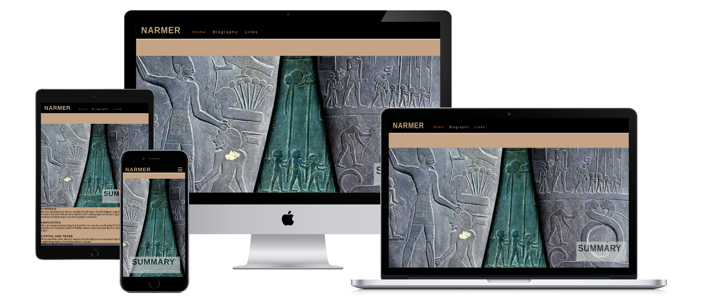
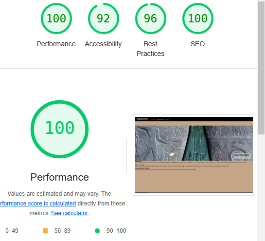
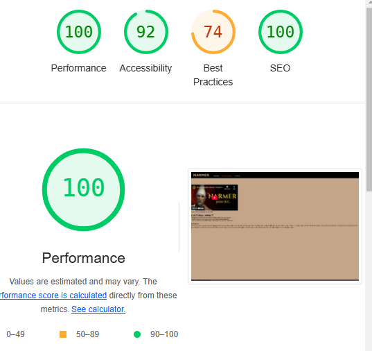
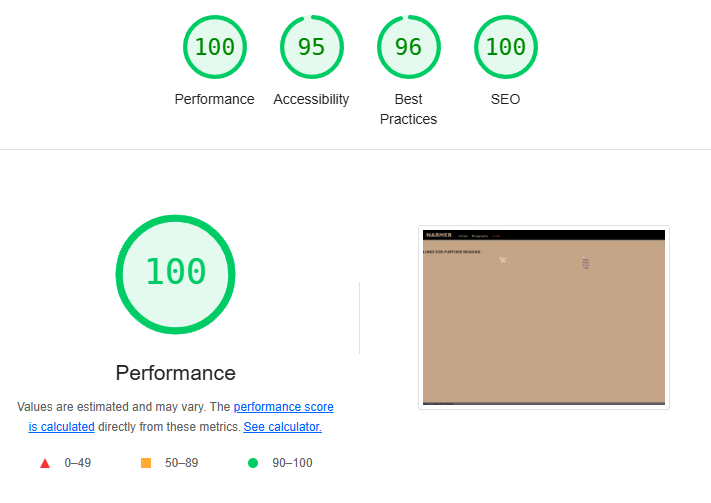
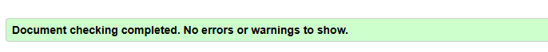
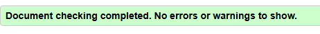
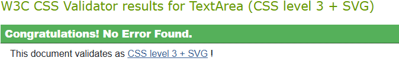

# Narmer

## A site about Egypt's first pharaoh   

On this page you will learn something about Narmer, on the first page we have basic summary, on the second page, we have a embedded video from youtube, and on the last page we have links to further reading.

Why have i created this site?

**For 2 reasons:**

 - Because i happened to have fallen asleep to a history of Egypt podcast recently

 - To enter as my first project to the [Code Institute](https://codeinstitute.net/se/?nab=1)
 

## Features

### Existing Features:

**Navigation Bar**

- Featured on all pages, with links to Home, Biography and Links pages.
- Becomes a dropdown menu on smaller screen widths.
- Highlight the page you are currently on
- Highlight when hover over on bigger screens

**Video**

- iframe embedded youtube video from a history content creator on the subject
- does not autoplay

**Links**

- Functional logo link for Wikipedia, the world history logo works in preview but not yet in deployed for some reason i cant figure out yet.
- opens on new blank tab

## Testing
I have tested the links and screen size adjustments on google chrome on pc and android.

Running it throu Lighthouse in the Google Devs tools to check acessability score.

**Validator Testing**

- HTML code tested via [W3 HTML Validator](https://validator.w3.org/)
+ Home

+ Biography

+ Links

- CSS code tested and clear via [W3 CSS Validator](https://jigsaw.w3.org/css-validator/)
+ CSS

## Deployment

- The site was deployed to GitHub pages. The steps to deploy are as follows: 
  - In the GitHub repository, navigate to the Settings tab 
  - From the source section drop-down menu, select the Master Branch
  - Once the master branch has been selected, the page will be automatically refreshed with a detailed ribbon display to indicate the successful deployment. 

The live link can be found here - https://dp19420.github.io/project-january-p1/index.html

## Credits

### Media

- Video credit: History Explained .
- FAvicon iconpack generated with [Real Favicon Generator](https://realfavicongenerator.net/)

### Code

- Navigation bar and Hero image coded with help of Love Running Walkthrou project.
- Favicon code generated and copied from [Real Favicon Generator](https://realfavicongenerator.net/)
- Menu bar icon code from [Font Awsome](https://fontawesome.com/) 